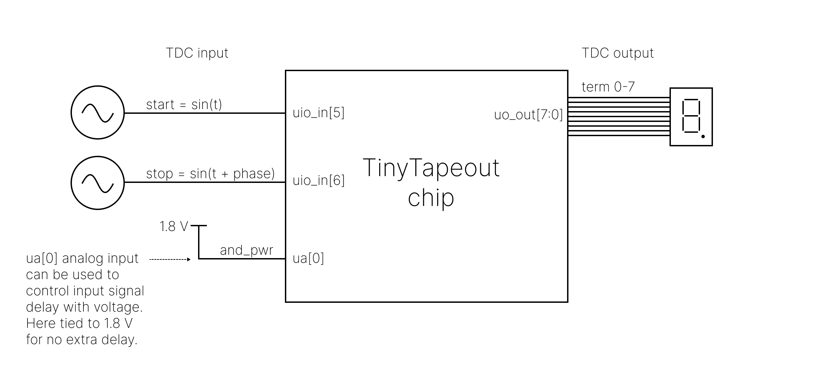
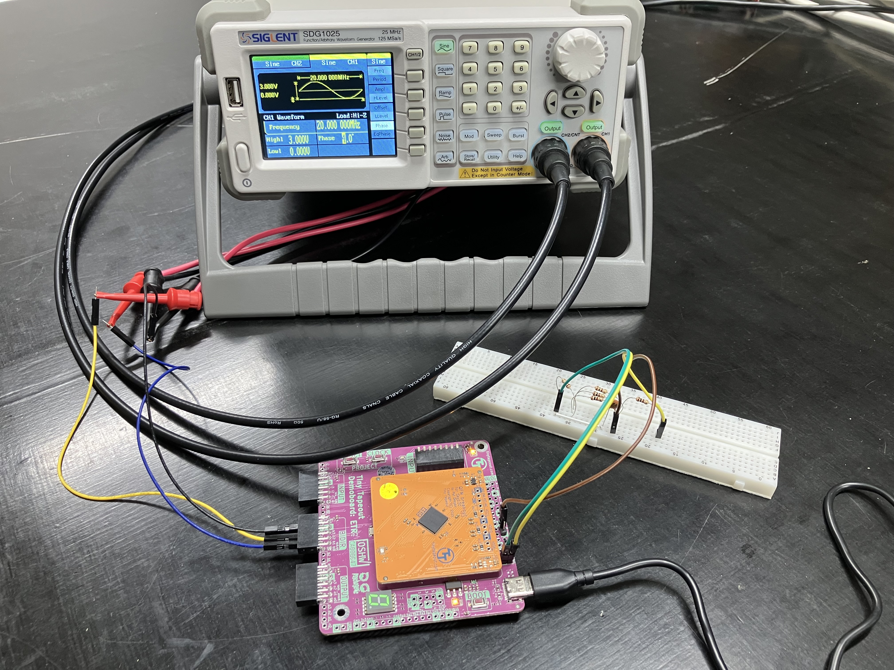
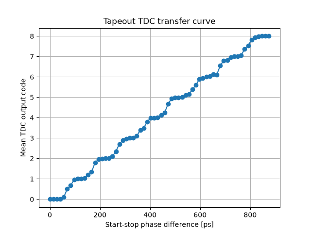

# Circuit Tests

1. Open the [Tiny Tapeout Commander](https://commander.tinytapeout.com/) in Chrome.
2. Connect to the board in the web app.
3. Open the REPL interface.
4. Select and enable the project:

```python
tt.shuttle.tt_um_13hihi31_tdc.enable()
```


### Architecture Overview

The circuit features dedicated input stages for both the **start** and **stop** signals:

* **Stop Path Delay:** The stop path includes an extra variable delay stage positioned right after its input stage.
* **Power-Starved AND Gate:** The stop input stage has its internal AND gate power rail routed directly to the analog chip input (ua[0]).

> **Prerequisite:** You must supply **1.8 V** to the analog input (ua[0]). If left unpowered, the internal AND gate will not turn on, locking the stop signal LOW. This pin was designed to allow delay tuning by power-starving the gate to increase its switching time. If power starvation isn't needed, simply tie it to a constant 1.8 V.

## Pinout Mapping

**Start Input Stage** (6 Digital Inputs)

* in: uio_in[6]
* en: uio_in[5]
* t0–t3: uio_in[1:4]

**Stop Input Stage** (5 Digital Inputs, 1 Analog Input)

* in: uio_in[6]
* en: Tied to VCC on-chip
* t0–t3: ui_in[0:3]
* and_pwr: ua[0]

**Stop Variable Delay Stage** (5 Digital Inputs)

* en_0: uio_in[0]
* en_1–en_4: ui_in[7:4]

**TDC Output**

* term_0–term_7: uo_out[0:7] (Mapped to 7-segment display segments A–G and DP)

## Testing Strategies

The uio_in[5] and uio_in[6] pins are critical to operation:

* uio_in[6] is shared as the input signal for both start and stop paths.
* uio_in[5] acts as the start enable signal.

### Method 1: Internal Delay Circuits

1. Set the desired delay for the start and stop input stages.
2. Set the desired delay for the stop variable delay stage.
3. Drive uio_in[5] HIGH.
4. Toggle uio_in[6] LOW $\to$ HIGH. This triggers both start and stop propagation simultaneously; the TDC output measures the net delay difference.
5. To reset the TDC output: drive uio_in[5] LOW, then toggle uio_in[6] LOW $\to$ HIGH.

### Method 2: Phase-Shifted External Signals

1. Set the desired delays across both input stages and the variable delay stage.
2. Drive uio_in[5] and uio_in[6] using an external signal generator with a controlled phase difference.

### Method 3: Analog Power Starvation

1. Configure internal delays as described in Method 1 or 2.
2. Drive inputs using either internal toggles or external phase-shifted signals.
3. Sweep ua[0] between **0.0 V** and **1.8 V** to alter gate propagation speed dynamically.

### Manual Testing: Capacitive Loading

When driving uio_in[5] and uio_in[6] externally, adding capacitance to the signal line will slow down propagation. Even touching or pinching the signal wire with your fingers adds enough parasitic capacitance to measurably alter the TDC output.

## REPL Signal Control

The fine delay uses **thermometer encoding**, whereas the coarse delay uses **one-hot encoding**. An input of all zeros (0b0000) is valid for both schemes.

### Pin Direction Setup

To allow an external signal generator to drive uio_in[5] and uio_in[6] while controlling lower pins via the Pico REPL:

```python
# Drive lower 5 bidirectional pins from Pico; uio_in[5:6] driven externally
tt.uio_oe_pico.value = 0b00011111
```

To control both uio_in[5] and uio_in[6] directly via REPL:

```python
tt.uio_oe_pico.value = 0b01111111
```

### Stop Path Delay Configuration

```python
# Minimum delay (zero relative to start signal)
tt.uio_in[0] = 1
tt.ui_in.value[7:4] = 0b0000

# Coarse delay steps
tt.uio_in[0] = 0
tt.ui_in.value[7:4] = 0b1000

tt.uio_in[0] = 0
tt.ui_in.value[7:4] = 0b0100

tt.uio_in[0] = 0
tt.ui_in.value[7:4] = 0b0010

tt.uio_in[0] = 0
tt.ui_in.value[7:4] = 0b0001

# Maximum delay
tt.uio_in[0] = 0
tt.ui_in.value[7:4] = 0b0000
```

### Input Stage Delay Configuration

**Stop Signal Input Stage Delay:**

```python
tt.ui_in[3:0] = 0b0000
```

* Minimum delay: 0b1111
* Intermediate delays: 0b0111, 0b0011, 0b0001
* Maximum delay: 0b0000

**Start Signal Input Stage Delay:**

```python
tt.uio_in[4:1] = 0b0000
```

* Minimum delay: 0b1111
* Intermediate delays: 0b0111, 0b0011, 0b0001
* Maximum delay: 0b0000

## Test Results

### Method 1 Execution & Data

```python
# Initialization (run once)
tt.uio_oe_pico.value = 0b01111111
tt.uio_in.value = 0b00000000

# Single TDC Combination Test
# Start delay setup: no input stage delay (1111), no variable stage delay (1000)
tt.ui_in.value = 0b10001111

# Set start enable & fire pulse
tt.uio_in[5] = 1
tt.uio_in[6] = 1

# Read TDC output
print(tt.uo_out.value)

# Reset output
tt.uio_in[5] = 0
tt.uio_in[6] = 1
```

#### Measured TDC Output vs. Delay Settings

| tt.ui_in.value | TDC output |
| --- | --- |
| 0b10001111 | 00000001 |
| 0b10001110 | 00000001 |
| 0b10001100 | 00000011 |
| 0b10001000 | 00000011 |
| 0b10000000 | 00000011 |
| 0b01001111 | 00000111 |
| 0b01001110 | 00000111 |
| 0b01001100 | 00001111 |
| 0b01001000 | 00001111 |
| 0b01000000 | 00001111 |
| 0b00101111 | 00011111 |
| 0b00101110 | 00111111 |
| 0b00101100 | 00111111 |
| 0b00101000 | 01111111 |
| 0b00100000 | 01111111 |
| 0b00010000 | 11111111 |
| 0b00011000 | 11111111 |
| 0b00011000 | 11111111 |
| 0b00011100 | 11111111 |
| 0b00011110 | 11111111 |
| 0b00011111 | 11111111 |

### Method 2: Transfer Curve Data Collection




To extract the transfer curve, set the stop signal variable delay to maximum. With zero phase offset on external signals, this configuration causes all TDC outputs to trigger.

1. Configure REPL setup:

```python
tt.ui_in.value = 0b00000000
tt.uio_oe_pico.value = 0b00011111
tt.uio_in[4:0] = 0b00000

def sample_output(count):
    for _ in range(count):
        print(tt.uo_out.value)
```

2. Introduce a positive phase shift to the stop signal using the generator. This advances the stop signal relative to the start signal, compensating for the internal delay.
3. At each phase step, record sample data:

```python
sample_output(1025)
```

4. Save raw logs to test_results/ and execute plot.py.

#### Signal Generator Parameters (SDG1025)

* **Waveform:** Sine
* **Frequency:** 20 MHz
* **Load:** High-Z
* **Voltage:** 0.0 V to 3.0 V

With $0.1^\circ$ phase increments on a 20 MHz signal ($T = 50\text{ ns}$), the step time delay calculates to:

$$\Delta t = \frac{\theta}{360^\circ} \times \frac{1}{f} = \frac{0.1^\circ}{360^\circ} \times 50\text{ ns} = 13.88\text{ ps}$$

Sweeping the phase from $2.0^\circ$ to $8.3^\circ$ spans the full TDC dynamic range.

#### Linear Fit Results (plot.py)



* **TDC Resolution (LSB):** 101.96 ps/code (0.1020 ns/code)
* **Gain (Sensitivity):** 9.808e+09 codes/sec
* **Linearity ($R^2$):** 0.9965

## Post-Mortem & Design Notes

Because uio_in[6] is shared across both start and stop paths, executing tt.uio_in[6] = 1 fires both signals simultaneously. Since the stop signal enable was tied directly to VCC during silicon layout, we can only adjust start signal delay relative to the stop signal via uio_in[5].

Consequently, we cannot naturally generate a stop signal that arrives *after* the start signal via pin toggles alone. Tying stop enable to VCC limited flexible edge ordering; in future revisions, leaving stop enable accessible would make testing far more versatile. To work around this constraint, we intentionally add internal delay to the stop path to force relative edge offsets.
